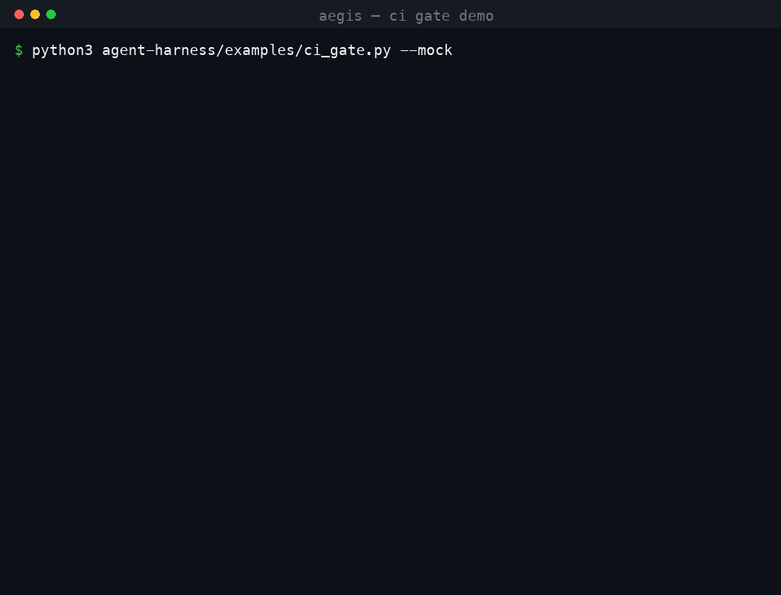

<div align="center">

# Aegis

**An LLM Agent Harness with Completion Defense**

以「完成防线」为核心的 Agent 执行控制系统：即使底层模型不稳定，也能产出可靠交付。
内置检索增强对话工作台（分层记忆 · 混合检索 · 前置安全）。


</div>

> **核心立场**：`Agent = Model + Harness`。模型是无状态函数，可靠性来自包在模型外面的
> 控制系统——行动前用前馈给足目标/规则/环境，行动后用反馈传感器观察结果并回传修正。

<div align="center">
  
</div>

---

## 🎯 它解决什么问题

把 Agent 接进真实交付流程时，最贵的失败不是「模型不会写代码」，而是**它说自己写完了**：
测试没跑、边界没覆盖、清单条目被悄悄降标准，而流程已经把这份产出当成完成态往下传。
模型越弱、任务越长，这种「假完成」越多——在本仓库的 A/B 评测里，朴素循环有 **78%** 的运行
宣称完成却过不了隐藏测试。

Aegis 不替换你正在用的 Agent。它包在执行引擎外面，做一件事：
**在「宣称完成」和「进入交付」之间加一道防线**——先跑项目自己的确定性检查，再核对行为级验收清单，
最后交给独立的只读验收子代理；任何一关不过就带着失败原因把任务打回去重做。

典型用法是 **CI 验收网关**：Claude Code（或任何 OpenAI 兼容模型）负责改代码，Aegis 负责判定
能不能算完成，并用进程退出码决定这次改动是否允许合入。

```
Claude Code 改完代码，宣称"任务完成"
        │
        ▼
[Aegis] 跑项目自己的检查命令（pre_done 传感器）
        │  不通过
        ▼
带着失败输出，用同一 session --resume 打回重做（上限 3 次）
        │  通过
        ▼
退出码 0 → 允许交付；否则退出码 1 + 交接记录 → CI 拦下
```

<div align="center">
  
</div>

上图是真实运行输出（由 [`docs/render_demo.py`](docs/render_demo.py) 直接跑命令渲染）：
先跑一次正常放行，再用 `--retries 0` 跑一次被拦下，退出码分别是 `0` 和 `1`。

一条命令看到完整链路（用脚本化的假 CLI，不需要任何 API key）：

```bash
python agent-harness/examples/ci_gate.py --mock
```

它会建一个临时代码库（`days_between` 未实现 + 一份真实单元测试），
让假 CLI 先交一版「看起来对但方向错」的实现并宣称完成，被防线用测试失败输出打回，
第二次修好后网关放行：

```text
状态      : done
模型轮次  : 4
防线打回  : 1
网关结论  : 通过，允许交付
```

把 `--retries 0` 加上就能看到被拦下的那一面：退出码 `1`、写出交接记录、失败测试原文回传。
接真实 Claude Code 只需换成自己的仓库和检查命令：

```bash
python agent-harness/examples/ci_gate.py \
  --workspace /path/to/repo \
  --goal "修掉 days_between 的符号 bug" \
  --check "python3 -m pytest -q"
```

---

## ✨ 亮点

- **完成防线（Completion Defense）** — 对抗 Agent「过早宣布完成」这一核心失效模式。A/B 评测中
  把**烂尾交付率从 78% 压到 0%**，真完成数由 5 提升至 9，代价为对话轮次约 3.3×。
  → [评测详情](agent-harness/eval/README.md)
- **上下文经济** — Tool Offloading 把 12089 字符的工具输出压到返回上下文 1527 字符
  （**降低约 87%**），信息零丢失、可按需取回。
- **可审计的记忆与检索** — 索引/证据双层记忆 + 混合检索（dense / BM25 / hybrid，MRR 0.953），
  命中可回跳原文溯源；并**明确标注了评测的有效边界**。
- **纵深防御** — `PreToolUse 检查 → Docker 沙箱执行 → PostToolUse 扫密钥 → Offload 卸载`，
  逻辑拦截叠加物理隔离。

## 📑 目录

- [它解决什么问题](#-它解决什么问题)
- [项目概览](#-项目概览)
- [Agent Harness](#️-agent-harness)
- [记忆与检索](#-记忆与检索)
- [架构概览](#️-架构概览)
- [技术栈](#-技术栈)
- [本地运行](#-本地运行)
- [工程踩坑记录](#-工程踩坑记录真实排查)
- [致谢与声明](#-致谢与声明)

---

## 📦 项目概览

系统由两个协同的部分组成：

**1. Agent Harness — 执行控制系统（核心）**
一套把可靠性放在模型之外的执行骨架：完成防线、上下文经济、生命周期钩子、容器沙箱。
设计思路对齐业界三家工程实践（腾讯 WorkBuddy、Anthropic、OpenAI Codex），纯 Python 标准库、
无框架依赖、可接入任何 OpenAI 兼容接口。

**2. Mini-OpenClaw 全栈 — 检索增强对话工作台**
分层可审计记忆 + 混合检索 + 前置安全的本地优先 Agent 工作台。参考
[langchain-miniopenclaw](https://github.com/lyxhnu/langchain-miniopenclaw) 的架构二次开发并重构：
`pgvector` 环境、多厂商 Embedding/LLM 接入、蒸馏入库、MRR 消融评测，以及可恢复状态机入库、
证据回跳、Guardian fail-closed 安检等工程实现。

---

## 🛡️ Agent Harness

Agent Harness 是本项目的核心。它把「模型」当作无状态函数，可靠性完全由外层控制系统负责：
行动前用**前馈**给足目标、规则、环境与能力；行动后用**反馈传感器**观察结果，把错误与修正回传给模型。

```
                    ┌─────────────────────────────────────────┐
                    │            AgentLoop (loop.py)          │
                    │  ReAct 循环 · 完成防线 · 预算 · 压缩 · 交接 │
                    └───────┬─────────────────────┬───────────┘
        前馈 Feedforward     │                     │     反馈 Feedback
  ┌─────────────────────────┴──┐               ┌──┴──────────────────────────┐
  │ ContextBuilder (context.py)│               │ SensorBank (sensors.py)     │
  │  稳定前缀: 系统提示+规则文件  │               │  post_edit / pre_done /     │
  │  动态追加: 环境+记忆+清单     │               │  periodic 计算型检查         │
  │ SkillLibrary (skills.py)   │               │ FileGuard (guards.py)       │
  │ MemoryStore (memory.py)    │               │  时间戳写入保护               │
  │  五类陈述性记忆+准入判断      │               │ Evaluator (subagent.py)     │
  └────────────────────────────┘               │  独立验收(推断型,最后动用)     │
  ┌────────────────────────────────────────────┴─────────────────────────────┐
  │ 执行与约束: ToolRegistry (tools.py) + builtin_tools.py                    │
  │  渐进式加载 · 结果截断外置 · 可纠正错误 · Policy/ApprovalGate/AuditLog      │
  └──────────────────────────────────────────────────────────────────────────┘
  ┌──────────────────────────────────────────────────────────────────────────┐
  │ 任务状态: Checklist + Handoff (tasks.py) — 行为级验收清单 · 跨会话交接      │
  └──────────────────────────────────────────────────────────────────────────┘
```

### 完成防线（Completion Defense）

对抗 Agent「过早宣布完成」这一核心失效模式：宣称完成时依次过 **pre_done 传感器（可见检查）
→ 行为级验收清单核对 → 独立 Evaluator 子代理**，未达标则打回、把修正信息重注入目标
（Ralph-Loop，上限 3 次）。验收由全新上下文的只读子代理执行，不轻信实现者的结论。

**A/B 评测结果**（glm-4-flash × 9 任务 × 每臂 27 次运行，隐藏测试判卷、对 Agent 不可见）：

| 指标 | baseline（关防线） | defense（开防线） |
| --- | :---: | :---: |
| 真完成（隐藏测试通过） | 5 · 18.5% | **9 · 33.3%** |
| **烂尾进入交付** | **21 · 78%** | **0 · 0%** |
| 平均模型轮次 | 5.0 | 16.3 · ≈3.3× |

> 防线把 78% 的烂尾交付降为 0，并靠返工救回额外的真完成；代价是算力开销约 3.3×。
> 评测方法、局限与「验收器偏严」的自省见 [评测说明](agent-harness/eval/README.md)。

### 对齐三家工程实践

**腾讯 WorkBuddy — 五层 Harness 控制系统**

- 运行环境层 → `policy.py`（工作区边界、命令 allowlist/denylist、审批门）、`audit.py`（JSONL 审计）
- 引导层（前馈）→ `context.py`（稳定前缀 + 动态追加，Prompt Cache 友好）、`skills.py`、`memory.py`
- 反馈层 → `sensors.py`（计算型优先、按时机分层）、`guards.py`（编辑前时间戳校验），
  工具错误带失败原因/是否可重试/建议下一步
- 编排层 → 工具与 Skill 渐进式加载、子代理隔离（`subagent.py`）
- 迭代层 → 传感器、规则文件、Skill 均为数据与配置，可随模型与失败模式增删

**Anthropic — 长任务 harness 与对抗式验收**

- 行为级验收清单（JSON、pass/fail、禁止删条目和降标准、pass 必须附证据）→ `tasks.py Checklist`
- 进度文件交接、恢复现场 → `tasks.py Handoff`，开跑时注入「上次交接记录」
- Planner / Generator / Evaluator 分离，验收可用不同模型 → `subagent.py` + `defense.py CompletionDefense`

**OpenAI Codex — 规则文件 + 确定性检查**

- AGENTS.md 作为目录入口、详细知识外置按需查询 → `context.py` + `templates/AGENTS.md`
- 确定性检查（lint/结构测试）每次修改后自动运行 → post_edit 传感器
- 「Agent 卡住 = 环境缺少工具/规则/文档的信号」→ 工具错误提示与交接文件显式记录环境缺失

### 关键设计决策

- **完成防线的顺序**：先跑便宜的计算型信号（传感器、清单状态），全部通过才动用昂贵的
  推断型验收（Evaluator 子代理），成本与可靠性兼顾。
- **fail-closed**：非交互环境下高危操作默认拒绝；验收输出解析失败按「未通过」处理。
- **上下文只追加**：历史消息不改写以稳定命中缓存；唯一例外是超阈值压缩，把最老的长工具结果
  外置到文件、窗口内保留位置信息。
- **Memory 与 Skill 分工**：事实进记忆、方法进 Skill；Skill 是文件，可版本化、可评审、可回滚。

### 工具链能力

- **Tool Offloading** (`backend/tools/tool_offload.py`) — 工具大输出超阈值时只保留头尾、
  完整内容卸载到文件系统并返回 `read_file` 引用路径。*实测 12089 → 1527 字符（降低约 87%），
  信息零丢失。*
- **生命周期 Hooks** (`backend/tools/hooks.py`) — `PreToolUse` 执行前拦截危险命令
  （`rm -rf`、fork 炸弹、`mkfs` 等）；`PostToolUse` 扫描并打码输出中的密钥泄露。
- **Docker 沙箱** (`backend/tools/sandbox.py`) — 代码执行运行于隔离容器：禁网络
  （`--network none`）、限内存/CPU、根文件系统只读、跑完即焚。*实测：容器内联网失败、
  死循环超时被杀、正常代码正常返回。*

### 快速开始（Harness）

```bash
export OPENAI_BASE_URL=https://your-gateway/v1   # 任何 OpenAI 兼容接口
export OPENAI_API_KEY=sk-...
export HARNESS_MODEL=your-model
export HARNESS_EVAL_MODEL=another-model          # 可选：验收用不同模型

python agent-harness/examples/run_task.py "把 utils/date.py 里的时区 bug 修掉并补测试" /path/to/workspace
```

运行状态保存在工作区 `.harness/` 下：`checklist.json`、`HANDOFF.md`、`memory.json`、
`audit.jsonl`、`overflow/`（外置的长结果）。中断后重跑同一目标即可从交接记录恢复现场。

### 可插拔执行引擎

Harness 的验收与交付契约独立于模型循环：内置 `AgentLoop` 可直接调用 OpenAI 兼容接口，
`ClaudeCodeRuntime` 则把执行交给 Claude Code CLI，并在 CLI 进程外复用同一套完成防线。
首次执行通过 `claude -p ... --output-format json`，防线未通过时使用同一 `session_id`
通过 `--resume` 注入修正信息，最多返工 3 次；CLI 报错、超时、JSON 解析失败和额度错误均不会被当作完成。
装配示例见 [`examples/ci_gate.py`](agent-harness/examples/ci_gate.py)（CI 验收网关，可 `--mock` 离线运行）。

使用 Claude Code runtime 时，实际模型由 Claude Code 的环境变量决定。例如：

```bash
export ANTHROPIC_BASE_URL=https://open.bigmodel.cn/api/anthropic
export ANTHROPIC_AUTH_TOKEN=your-zhipu-key
export ANTHROPIC_MODEL=glm-4-flash
```

Claude Code CLI 本身是本地执行程序，安装不等于获得 Anthropic 模型额度；配置代理后，实际请求由代理服务商计量。
控制台现金余额为零也不必然代表免费模型配额为零，但免费配额通常受每日、每分钟、并发和账户策略限制。
Claude Code 输出的 `total_cost_usd` 是按 Anthropic 定价计算的估算字段，使用代理时不能当作真实账单。
建议先跑一个任务确认 `is_error`、`session_id`、`num_turns` 和 `modelUsage`，再扩大评测规模。

### 已知边界

- 业务正确性验证没有银弹：清单 + 独立验收降低了「实现与测试共享同一误解」的概率但不能消除，
  核心业务逻辑应降低自治度、保留人工审批。
- 传感器依赖工程本身的可检查性：老系统先补结构、测试与可观测性，再上 Harness。
- Loop Engineering（定时触发、独立 worktree、跨轮运行）不在本仓库内，但 `Checklist` /
  `Handoff` / `Budget` / 传感器均为被外部 Loop 调度而设计的组件。

---

## 🧠 记忆与检索

### Durable 记忆入库（可恢复状态机）

入库从「存在即跳过」的单点幂等，重构为状态机驱动的可恢复流程。每个 exchange 走
`pending → distilled → done`，**每次状态跃迁与其依赖写入在同一事务原子提交**；崩溃重启后只处理
`status != done` 的 exchange，停在 `distilled` 的只补 embedding、不重跑昂贵蒸馏。
实现：`memory_v2.memory_exchanges.status` + `ObjectsRepo.upsert_object_mark_distilled` /
`attach_embedding_mark_done`，编排在 `service/api.py:distill_session`。

### 可审计的分层记忆

不把对话全量塞进向量库，分两层：**索引层**（结构化蒸馏卡片 + 向量，用于检索）与
**证据层**（原文 verbatim，用于溯源），以 `exchange_id` 关联。命中后可回跳原始对话轮次原文，
抑制幻觉、保证可审计。索引可丢弃重建，原文为唯一事实源。

### 混合检索 + MRR 消融

向量（pgvector 余弦）查蒸馏卡片、BM25（jieba 中文分词）查原文，加权融合 + 阈值过滤，
RRF 为可选 fallback。

| 模式 | MRR | Hit Rate |
| --- | :---: | :---: |
| dense（向量） | 0.953 | 1.0 |
| keyword（BM25） | 0.953 | 1.0 |
| hybrid（混合） | 0.953 | 1.0 |

> **诚实标注评测局限**：Scheme A 用每个 exchange 的原始提问作为 query、该 exchange 自身作为
> 唯一正确答案，query 与答案同源、检索任务偏简单，三路均接近满分、区分不出策略优劣。
> 该评测验证了检索链路的端到端正确性，但要比较策略差异需 query 改写或人工标注难负样本。

### Guardian 前置安全

挂在 middleware 链最前（所有请求必经、不留旁路），小模型二分类（temperature=0，输出强约束），
**fail-closed**（故障默认拦截），对外统一文案不暴露触发规则。

---

## 🏗️ 架构概览

```
用户输入
  → Guardian 安检（middleware 最前）
  → query embedding
  → 混合检索（dense 查卡片 / BM25 查原文 → 融合 → 阈值过滤 → top-k）
  → 证据回跳取原文
  → 拼 prompt（技能快照 + 记忆命中 + 对话历史）
  → 主模型生成（SSE 流式推送）

工具调用：PreToolUse → Docker 沙箱 → PostToolUse → Offload
Agent 执行：前馈(目标/规则/环境) → ReAct 循环 → 完成防线(传感器→清单→独立验收) → 交接
```

## 🧰 技术栈

`Python` · `FastAPI` · `Next.js` · `LangChain 1.x` · `PostgreSQL + pgvector` ·
`BM25(jieba)` · `Docker` · `Langfuse` · `SSE`

## 🚀 本地运行

> 「本地运行」指数据与工具执行在本地，模型调用走云端 API（非本地推理）。

```bash
# 1. 起带 pgvector 的 Postgres
docker run -d --name miniclaw-pg -e POSTGRES_PASSWORD=*** \
  -e POSTGRES_DB=miniclaw -p 5433:5432 pgvector/pgvector:pg16

# 2. 后端
cd backend
python -m venv .venv && source .venv/bin/activate   # Windows: .venv\Scripts\activate
pip install -r requirements.txt
# 复制 config/.env.example 为 config/.env，填入 LLM/Embedding key 与数据库连接
uvicorn app:app --host 0.0.0.0 --port 8002 --reload

# 3. 蒸馏入库 + 评测
python script/distill_all_sessions.py
python memory_module_v2/eval/generate_ground_truth.py
python memory_module_v2/eval/evaluate_mrr.py --mode hybrid_cross --labels <ground_truth.jsonl>

# 4. 前端
cd frontend && npm install && npm run dev   # http://localhost:3000
```

Agent Harness 的详细设计与运行见 [`agent-harness/`](agent-harness/README.md)；
完成防线 A/B 评测见 [`agent-harness/eval/`](agent-harness/eval/README.md)。

## 🐞 工程踩坑记录（真实排查）

围绕「换 Embedding 供应商（智谱 → 百炼）」的一连串排查，共性是**配置加载链**与
**环境/接口差异**——同样的代码，换个供应商、换个运行入口、换个操作系统就暴露问题：

- **向量维度硬约束**：Embedding 维度与表 schema 强绑定。换模型（2048 → 1024 维）必须同步
  `ALTER COLUMN embedding TYPE vector(1024)` 并重算全部向量，否则写库报维度不匹配。
- **OpenAI 兼容接口不完全兼容**：换百炼后向量化报 `400 contents is neither str nor list of str`。
  根因是 LangChain `OpenAIEmbeddings` 默认 `check_embedding_ctx_length=True`，会先把文本切成
  token id 整数列表再发送——真 OpenAI 接受，百炼兼容接口只认字符串。解法：传
  `check_embedding_ctx_length=False`。
- **配置加载链断裂**：BM25 重建脚本卡死不报错。根因是 `pg.py` 用 `os.getenv("POSTGRES_DSN")`
  读配置，但单独用 `python -c` 跑时没人调 `load_dotenv`，环境变量为空、fallback 到错端口。
- **Windows localhost → IPv6 坑**：叠加上一条——`localhost` 在 Windows 优先解析成 IPv6 `::1`，
  而 Docker 端口映射在 IPv4，连接卡在 IPv6 超时。表现为**卡死而非报错**（更难查）。改用
  `127.0.0.1` 强制 IPv4。
- **工作目录 + 相对路径嵌套**：ground truth 脚本报 `written=32` 但读到的文件只有 9 行。根因是
  写入路径带 `backend/` 前缀，在 backend 目录下运行嵌套成 `backend/backend/...`。
- **BM25 离线索引过时**：新数据入库后 BM25 召回为 0——向量随入库即新鲜，BM25 是离线索引，
  必须显式 `force_rebuild`。
- **幂等半完成状态（已修复）**：写原文与建卡片原本非原子，崩在中间会留下「原文有、卡片无」的
  残缺状态被幂等逻辑误跳过。现重构为状态机可恢复入库（详见 [Durable 记忆入库](#durable-记忆入库可恢复状态机)）。

---

## 🙏 致谢与声明

- 基础项目：[lyxhnu/langchain-miniopenclaw](https://github.com/lyxhnu/langchain-miniopenclaw)
- memory_module_v2 思路论文：https://arxiv.org/html/2603.13017v1
- 本项目用于学习与研究。底层检索/记忆全栈参考基础项目二次开发，相关版权归原作者所有；
  Agent Harness（完成防线 / Offloading / Hooks / 沙箱）为本人独立设计实现。
