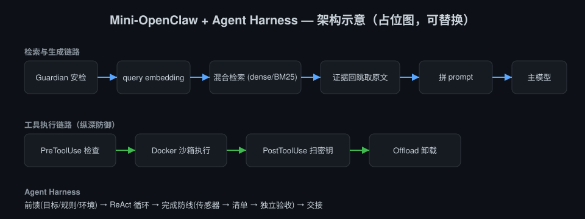
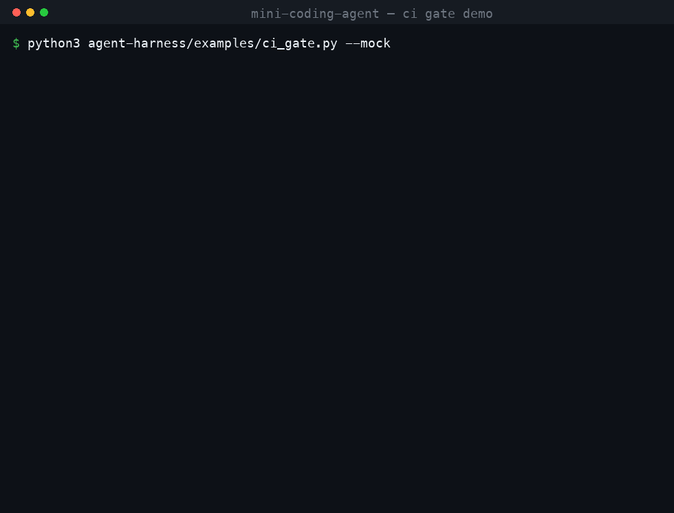

<div align="center">

# mini-coding-agent

**从 Agent Loop 写起的编码 Agent — 重点不在能跑，而在跑不好的时候怎么办**

自己实现的 ReAct 执行循环、工具层与上下文管理，外加一套完成判定机制；
并用隐藏测试判卷的 A/B 实验量化了它到底有没有用。


</div>

> **一句话**：Agent Loop 本身两百行就能跑通，难的是它跑歪之后的每一种情况——
> 说自己做完了其实没做完、工具输出撑爆上下文、改了别人正在改的文件、
> 预算烧光却什么也没留下。这个仓库主要在处理后面这些。

<div align="center">
  
</div>

---

## 🎯 先说结论：循环不难，失败模式才难

先写出一个能调模型、能执行工具、能把结果塞回上下文的循环，一个下午就够了。
把它接到真实任务上跑，问题立刻换了一副面孔——最贵的失败不是「模型不会写代码」，
而是**它说自己写完了**：测试没跑、边界没覆盖、验收条目被悄悄降标准，
而流程已经把这份产出当成完成态往下传。

这不是猜测。同一批任务、同一个模型（`glm-4-flash`）、隐藏测试判卷，
朴素循环有 **77.8%** 的运行宣称完成却过不了测试（按 27 次运行计）：

| 指标 | 朴素循环 | 加上完成判定 |
| --- | :---: | :---: |
| 真完成（隐藏测试 + 回归测试通过） | 5 · 18.5% | **9 · 33.3%** |
| **烂尾进入交付** | **21 · 77.8%** | **0 · 0%** |
| `pass^3`（3 次运行全部通过） | 1 / 9 任务 | **2 / 9 任务** |
| 平均模型轮次 | 5.0 | 16.3 · ≈3.3× |

代价是算力约 3.3×。方法、局限与自省见 [评测说明](agent-harness/eval/README.md)。

---

## 🔦 一个场景：挂到 CI 上当交付网关

把这套判定接到流水线里：Agent 改代码，网关用**仓库自己的判据**决定这次改动能不能合入，
不达标就带着失败证据打回重做，最终以进程退出码交给 CI。

```
Agent 改完代码，宣称"任务完成"
        │
        ▼
跑仓库自己的检查命令（pre_done 传感器）
        │  不通过
        ▼
带着失败输出打回重做（上限 3 次，同一会话续跑）
        │  通过
        ▼
退出码 0 → 允许交付；否则退出码 1 + 交接记录 → CI 拦下
```

<div align="center">
  
</div>

上图是真实运行输出（由 [`docs/render_demo.py`](docs/render_demo.py) 直接跑命令渲染）：
先跑一次正常放行，再用 `--retries 0` 跑一次被拦下，退出码分别是 `0` 和 `1`。

一条命令看到完整链路，不需要任何 API key：

```bash
python agent-harness/examples/ci_gate.py --mock
```

它会建一个临时代码库（`days_between` 未实现 + 一份真实单元测试），
让脚本化的假执行器先交一版「看起来对但方向错」的实现并宣称完成，
被测试失败输出打回，第二次修好后网关放行：

```text
状态      : done
模型轮次  : 4
防线打回  : 1
网关结论  : 通过，允许交付
```

接自己的仓库只需换成真实执行器和检查命令：

```bash
python agent-harness/examples/ci_gate.py \
  --workspace /path/to/repo \
  --goal "修掉 days_between 的符号 bug" \
  --check "python3 -m pytest -q"
```

---

## ✨ 做了什么

- **Agent 主体** — 自己实现的 ReAct 循环、工具注册表与执行约束、流式输出与 `tool_calls`
  增量拼装、上下文压缩、子代理隔离，纯 Python 标准库、无框架依赖，可接任何 OpenAI 兼容接口。
- **完成判定（Completion Defense）** — 传感器 → 验收清单 → 独立验收子代理三级判定，
  不达标打回重做。A/B 评测中把**烂尾交付率从 77.8% 压到 0%**。
- **上下文经济** — 工具大输出只留头尾、完整内容外置到文件并返回引用路径。
  *实测 12089 → 1527 字符（降低约 87%），信息零丢失、可按需取回。*
- **纵深防御** — `PreToolUse 检查 → Docker 沙箱执行 → PostToolUse 扫密钥 → Offload 卸载`，
  逻辑拦截叠加物理隔离。
- **可插拔执行层** — 同一套完成判定既能驱动自带循环，也能套在 Claude Code CLI 外面，
  验证了判定层与执行层的解耦。
- **早期工作：检索增强工作台** — 索引/证据双层记忆 + 混合检索（MRR 0.953），命中可回跳原文溯源。

## 📑 目录

- [先说结论](#-先说结论循环不难失败模式才难)
- [一个场景：CI 交付网关](#-一个场景挂到-ci-上当交付网关)
- [Agent 主体：循环与工具层](#-agent-主体循环与工具层)
- [流式输出与工具调用拼装](#流式输出与工具调用拼装)
- [完成判定](#️-完成判定)
- [可插拔执行层](#-可插拔执行层claude-code-作为-runtime)
- [早期工作：检索增强工作台](#-早期工作检索增强工作台)
- [路线图与已知边界](#-路线图与已知边界)
- [本地运行](#-本地运行)
- [工程踩坑记录](#-工程踩坑记录真实排查)
- [致谢与声明](#-致谢与声明)

---

## 🧩 Agent 主体：循环与工具层

模型被当作无状态函数，一切状态与约束都在外层：行动前用**前馈**给足目标、规则、环境与能力；
行动后用**反馈**观察结果，把错误与修正回传给模型。

```
                    ┌─────────────────────────────────────────┐
                    │            AgentLoop (loop.py)          │
                    │  ReAct 循环 · 完成判定 · 预算 · 压缩 · 交接 │
                    └───────┬─────────────────────┬───────────┘
        前馈 Feedforward     │                     │     反馈 Feedback
  ┌─────────────────────────┴──┐               ┌──┴──────────────────────────┐
  │ ContextBuilder (context.py)│               │ SensorBank (sensors.py)     │
  │  稳定前缀: 系统提示+规则文件  │               │  post_edit / pre_done /     │
  │  动态追加: 环境+记忆+清单     │               │  periodic 计算型检查         │
  │ SkillLibrary (skills.py)   │               │ FileGuard (guards.py)       │
  │ MemoryStore (memory.py)    │               │  时间戳写入保护               │
  │  五类陈述性记忆+准入判断      │               │ Evaluator (subagent.py)     │
  └────────────────────────────┘               │  独立验收(推断型,最后动用)     │
  ┌────────────────────────────────────────────┴─────────────────────────────┐
  │ 执行与约束: ToolRegistry (tools.py) + builtin_tools.py                    │
  │  渐进式加载 · 结果截断外置 · 可纠正错误 · Policy/ApprovalGate/AuditLog      │
  └──────────────────────────────────────────────────────────────────────────┘
  ┌──────────────────────────────────────────────────────────────────────────┐
  │ 任务状态: Checklist + Handoff (tasks.py) — 行为级验收清单 · 跨会话交接      │
  └──────────────────────────────────────────────────────────────────────────┘
```

循环里几个不显然但必要的处理：

- **工具错误是可利用的信号**，不是异常。`ToolOutput` 带失败原因、是否可重试、建议下一步；
  文件不存在会附上同目录相近文件名，`edit_file` 的 `old_string` 不唯一会要求重读定位。
- **写入前必须先读**：`FileGuard` 记录读取时间戳，文件在读取后被外部改动则拒绝写入，
  避免覆盖用户或并发任务的修改。
- **工具按需暴露**：非核心工具默认不进 schema，模型用 `load_tools` 显式加载，
  控制工具数量对决策质量的干扰。
- **超阈值才压缩**：历史只追加以稳定命中 Prompt Cache；唯一例外是超过阈值时，
  把最老的长工具结果外置到文件、窗口内保留位置信息。
- **预算耗尽不硬撑**：写清「已完成 / 下一步 / 缺什么环境」的交接文件后停止，留下可诊断现场。

### 流式输出与工具调用拼装

流式的难点不在 SSE，而在 **`tool_calls` 是被切碎送来的**：

```text
{"delta": {"tool_calls": [{"index": 0, "id": "call_1",
                           "function": {"name": "write_file", "arguments": "{\"pa"}}]}}
{"delta": {"tool_calls": [{"index": 0,
                           "function": {"arguments": "th\": \"a.py\"}"}}]}}
```

`arguments` 中途每一片都不是合法 JSON，只能按 `index` 累积、流结束后整体解析；
`id` 与 `name` 通常只在首片出现，后续分片不能覆盖成空；多个工具调用会交错到达，
`index` 是唯一可靠的归组依据。实现在 [`streaming.py`](agent-harness/harness/streaming.py)，
拼装逻辑不碰网络因而可单测（分片切割、交错、截断、缺函数名、`[DONE]` 哨兵、心跳注释）。

两个刻意的判断：

- **断流不重试**。非流式请求超时可以安全重试，流式不行——已经吐给用户的内容收不回，
  工具调用还可能被执行两次。所以只在「一个分片都没收到」时才重试，否则直接上抛。
- **拼不出合法参数不猜**。截断的 `arguments` 保留原文交给工具层报可纠正的错误，
  而不是补全成一个看起来合法、实际内容错的参数。


### 工具链能力

- **Tool Offloading** (`backend/tools/tool_offload.py`) — 大输出只保留头尾、完整内容落盘并返回
  `read_file` 引用路径。*实测 12089 → 1527 字符，降低约 87%。*
- **生命周期 Hooks** (`backend/tools/hooks.py`) — `PreToolUse` 拦截危险命令（`rm -rf`、fork 炸弹、
  `mkfs` 等）；`PostToolUse` 扫描并打码输出中的密钥。
- **Docker 沙箱** (`backend/tools/sandbox.py`) — 代码执行运行于隔离容器：禁网络、限内存/CPU、
  根文件系统只读、跑完即焚。*实测：容器内联网失败、死循环超时被杀、正常代码正常返回。*

### 快速开始

```bash
export OPENAI_BASE_URL=https://your-gateway/v1
export OPENAI_API_KEY=sk-...
export HARNESS_MODEL=your-model
export HARNESS_EVAL_MODEL=another-model

python agent-harness/examples/run_task.py "把 utils/date.py 里的时区 bug 修掉并补测试" /path/to/workspace
```

运行状态保存在工作区 `.harness/` 下：`checklist.json`、`HANDOFF.md`、`memory.json`、
`audit.jsonl`、`overflow/`。中断后重跑同一目标即可从交接记录恢复现场。

---

## 🛡️ 完成判定

模型停止调用工具，即视为它宣称完成——这时才开始判定，依次过三关，
**按「先便宜后昂贵」排序**：

1. **pre_done 传感器** — 跑确定性命令（测试、lint、构建），成本近乎为零；
2. **行为级验收清单** — 检查是否还有未标 pass 的条目；条目不可删除、描述不可修改、
   标 pass 必须附证据；
3. **独立 Evaluator 子代理** — 全新上下文、只读工具、可用不同模型，不把实现者的结论当输入前提；
   输出解析失败按「未通过」处理（fail-closed）。

任何一关不过，就把失败原因组装成修正信息重新注入目标继续执行（上限 3 次）。
打回文案显式禁止降低标准和删除条目——否则模型会倾向于改清单而不是改代码。

评测用**隐藏测试**判卷：测试在 Agent 执行完成后才写入工作区，运行期间完全不可见，
避免「实现与测试共享同一误解」。指标区分「真完成」「烂尾进入交付」「被拦下未交付」。

### 对齐的三家工程实践

**腾讯 WorkBuddy — 五层控制系统**

- 运行环境层 → `policy.py`（工作区边界、命令 allowlist/denylist、审批门）、`audit.py`（JSONL 审计）
- 引导层（前馈）→ `context.py`（稳定前缀 + 动态追加）、`skills.py`、`memory.py`
- 反馈层 → `sensors.py`（计算型优先、按时机分层）、`guards.py`（写入前时间戳校验）
- 编排层 → 工具与 Skill 渐进式加载、子代理隔离（`subagent.py`）
- 迭代层 → 传感器、规则文件、Skill 均为数据与配置，可随模型与失败模式增删

**Anthropic — 长任务与对抗式验收**

- 行为级验收清单（JSON、pass/fail、禁止删条目和降标准、pass 必须附证据）→ `tasks.py Checklist`
- 进度文件交接、恢复现场 → `tasks.py Handoff`，开跑时注入「上次交接记录」
- Planner / Generator / Evaluator 分离，验收可用不同模型 → `subagent.py` + `defense.py`

**OpenAI Codex — 规则文件 + 确定性检查**

- AGENTS.md 作为目录入口、详细知识外置按需查询 → `context.py` + `templates/AGENTS.md`
- 确定性检查每次修改后自动运行 → post_edit 传感器
- 「Agent 卡住 = 环境缺少工具/规则/文档的信号」→ 工具错误提示与交接文件显式记录环境缺失

---

## 🔌 可插拔执行层：Claude Code 作为 runtime

完成判定不依赖「谁在跑循环」。`Runtime` 协议约定了统一的结果契约，目前有两个实现：

- `AgentLoop` — 自带循环，直连 OpenAI 兼容接口，A/B 评测数据来自这里；
- `ClaudeCodeRuntime` — 把执行交给 Claude Code CLI，判定层退到进程外。

需要说清楚的边界：**Claude Code 自己就有完整的 harness**——工具集、权限模式、
上下文管理、hooks 都是它的。这里补的不是那一层，而是它管不了、也不该管的**场景级判定**：
这个仓库怎么算完成、不达标要不要打回、打回几次收手、最终该不该放行、结论怎么交给流水线。

实现上：首次 `claude -p ... --output-format json`，解析 `session_id`；判定未通过时用
`--resume` 在同一会话注入修正信息，最多返工 3 次。CLI 报错、超时、JSON 解析失败、
额度错误都返回结构化结果而不是异常，且**都不会被当作完成**。
装配示例见 [`examples/ci_gate.py`](agent-harness/examples/ci_gate.py)。

一个刻意的取舍：没有把判定绑到 Claude Code 的 `Stop` hook 上。headless 模式下 hook 行为存在
版本差异，进程层编排更确定；hook 只作为可选增强。

```bash
export ANTHROPIC_BASE_URL=https://your-anthropic-compatible-gateway
export ANTHROPIC_AUTH_TOKEN=your-key
export ANTHROPIC_MODEL=your-model
```

Claude Code CLI 本身是本地程序，安装不等于获得模型额度；配置代理后请求由代理服务商计量，
免费配额通常受每日、每分钟、并发和账户策略限制。它输出的 `total_cost_usd` 是按 Anthropic
定价的估算字段，走代理时不能当作真实账单。

---

## 🧠 早期工作：检索增强工作台

时间上先于 Agent 主体，是一个 FastAPI + Next.js 的本地优先对话工作台，
和当前主线的关系是提供了记忆与检索的实践基础。参考
[langchain-miniopenclaw](https://github.com/lyxhnu/langchain-miniopenclaw) 的架构二次开发并重构。

- **可恢复入库** — 每个 exchange 走 `pending → distilled → done`，
  **状态跃迁与依赖写入在同一事务原子提交**；崩溃重启只处理 `status != done`，
  停在 `distilled` 的只补 embedding、不重跑昂贵蒸馏。
- **索引/证据双层记忆** — 索引层存结构化蒸馏卡片 + 向量用于检索，证据层存原文用于溯源，
  以 `exchange_id` 关联；命中可回跳原始对话轮次。索引可丢弃重建，原文是唯一事实源。
- **混合检索 + MRR 消融** — 向量（pgvector 余弦）查卡片、BM25（jieba 分词）查原文，
  加权融合 + 阈值过滤，RRF 为可选 fallback。三路 MRR 均为 0.953、Hit Rate 1.0。
  > 评测局限：query 取自 exchange 原始提问、正确答案是该 exchange 自身，
  > query 与答案同源、任务偏简单，三路接近满分因而**区分不出策略优劣**。
  > 它验证了检索链路端到端正确，但比较策略差异需要 query 改写或人工标注难负样本。
- **Guardian 前置安全** — 挂在 middleware 链最前（不留旁路），小模型二分类
  （temperature=0、输出强约束），**fail-closed**，对外统一文案不暴露触发规则。

---

## 🗺️ 路线图与已知边界

尚未实现，按优先级排列：

- **并行工具调用** — 当前顺序执行。难点不是并发本身，而是判断哪些可以并行：
  只读工具可并发，写同一文件的必须串行，否则和 `FileGuard` 的时间戳校验互相踩。
- **中断与 token 级预算** — 当前预算按字符数估算，且没有取消机制；
  长任务需要能在半途停下、落盘已有结果并写交接。

已知边界：

- 业务正确性验证没有银弹：清单 + 独立验收降低了「实现与测试共享同一误解」的概率但不能消除，
  核心业务逻辑应降低自治度、保留人工审批。
- 传感器依赖工程本身的可检查性：老系统先补结构、测试与可观测性，再上这套判定。
- Loop Engineering（定时触发、独立 worktree、跨轮运行）不在本仓库内，
  但 `Checklist` / `Handoff` / `Budget` / 传感器都是为被外部调度而设计的。

---

## 🚀 本地运行

> 「本地运行」指数据与工具执行在本地，模型调用走云端 API（非本地推理）。

Agent 主体只依赖 Python 标准库，见上方[快速开始](#快速开始)。
检索工作台需要数据库和前端：

```bash
docker run -d --name miniclaw-pg -e POSTGRES_PASSWORD=*** \
  -e POSTGRES_DB=miniclaw -p 5433:5432 pgvector/pgvector:pg16

cd backend
python -m venv .venv && source .venv/bin/activate
pip install -r requirements.txt
uvicorn app:app --host 0.0.0.0 --port 8002 --reload

python script/distill_all_sessions.py
python memory_module_v2/eval/generate_ground_truth.py
python memory_module_v2/eval/evaluate_mrr.py --mode hybrid_cross --labels <ground_truth.jsonl>

cd frontend && npm install && npm run dev
```

后端配置：复制 `config/.env.example` 为 `config/.env`，填入 LLM / Embedding key 与数据库连接。
前端默认 `http://localhost:3000`。

Agent 主体的详细设计见 [`agent-harness/`](agent-harness/README.md)；
A/B 评测见 [`agent-harness/eval/`](agent-harness/eval/README.md)。

## 🧰 技术栈

`Python` · `FastAPI` · `Next.js` · `LangChain 1.x` · `PostgreSQL + pgvector` ·
`BM25(jieba)` · `Docker` · `Langfuse` · `SSE`

## 🐞 工程踩坑记录（真实排查）

围绕「换 Embedding 供应商（智谱 → 百炼）」的一连串排查，共性是**配置加载链**与
**环境/接口差异**——同样的代码，换个供应商、换个运行入口、换个操作系统就暴露问题：

- **向量维度硬约束**：Embedding 维度与表 schema 强绑定。换模型（2048 → 1024 维）必须同步
  `ALTER COLUMN embedding TYPE vector(1024)` 并重算全部向量，否则写库报维度不匹配。
- **OpenAI 兼容接口不完全兼容**：换百炼后向量化报 `400 contents is neither str nor list of str`。
  根因是 LangChain `OpenAIEmbeddings` 默认 `check_embedding_ctx_length=True`，会先把文本切成
  token id 整数列表再发送——真 OpenAI 接受，百炼兼容接口只认字符串。解法：传
  `check_embedding_ctx_length=False`。
- **配置加载链断裂**：BM25 重建脚本卡死不报错。根因是 `pg.py` 用 `os.getenv("POSTGRES_DSN")`
  读配置，但单独用 `python -c` 跑时没人调 `load_dotenv`，环境变量为空、fallback 到错端口。
- **Windows localhost → IPv6 坑**：叠加上一条——`localhost` 在 Windows 优先解析成 IPv6 `::1`，
  而 Docker 端口映射在 IPv4，连接卡在 IPv6 超时。表现为**卡死而非报错**（更难查）。改用
  `127.0.0.1` 强制 IPv4。
- **工作目录 + 相对路径嵌套**：ground truth 脚本报 `written=32` 但读到的文件只有 9 行。根因是
  写入路径带 `backend/` 前缀，在 backend 目录下运行嵌套成 `backend/backend/...`。
- **BM25 离线索引过时**：新数据入库后 BM25 召回为 0——向量随入库即新鲜，BM25 是离线索引，
  必须显式 `force_rebuild`。
- **幂等半完成状态（已修复）**：写原文与建卡片原本非原子，崩在中间会留下「原文有、卡片无」的
  残缺状态被幂等逻辑误跳过。现重构为状态机可恢复入库。
- **示例文件被写坏**：`examples/run_task.py` 曾被写入带行号前缀的文本，Python 完全无法解析。
  教训是 `compileall` 只覆盖了 `harness/`，验证范围漏掉了 `examples/`。

---

## 🙏 致谢与声明

- 基础项目：[lyxhnu/langchain-miniopenclaw](https://github.com/lyxhnu/langchain-miniopenclaw)
- memory_module_v2 思路论文：https://arxiv.org/html/2603.13017v1
- 本项目用于学习与研究。检索/记忆全栈参考基础项目二次开发，相关版权归原作者所有；
  Agent 主体与完成判定（循环 / 工具层 / 判定机制 / Offloading / Hooks / 沙箱）为本人独立设计实现。
